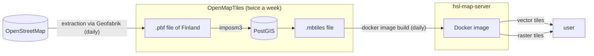

# HSL Maps

Related repositories:
- https://github.com/HSLdevcom/openmaptiles
- https://github.com/HSLdevcom/hsl-map-server
- https://github.com/HSLdevcom/hsl-map-style

The main datasource for the map products of HSL is OpenStreetMap. Also NaturalEarth is used on small scales, but in this documentation we mainly concentrate on OSM.

OpenStreetMap data is imported to OpenMapTiles schema, and that data is available via vector tiles API. HSL offers vector map and multiple raster map endpoints. Raster maps use the same vector tiles API but the style is predefined and map tiles are rasterized on server side.

See more info of APIs and how to use them on Digitransit page for developers:
https://digitransit.fi/en/developers/architecture/x-apis/3-map-api/
https://digitransit.fi/en/developers/apis/3-map-api/

## Data flow for background maps

OSM extraction (daily):

1. Data extraction from OpenStreetMap

[OpenMapTiles](https://github.com/HSLdevcom/openmaptiles) (twice a week):

2. Import data from OSM extraction to PostGIS (imposm3)
3. Retrieve data from PostGIS to vector tiles and store it in .mbtiles -format

[hsl-map-server](https://github.com/HSLdevcom/hsl-map-server) (daily build):

4. Create a new docker image with internal mbtiles-data and deploy it

[hsl-map-style](https://github.com/HSLdevcom/hsl-map-style):

5. Visualize vector map data with the style either on a client side (vector map requests) or inside hsl-map-server (raster map requests)

Chart of the process:

## OpenMapTiles

OpenMapTiles is an open pre-defined schema for vector tiles (https://openmaptiles.org/)  Note! There are a few customizations made for HSL, mainly to support bilingual map styles and also to add some extra features to our maps.

There are a couple of things that you need to understand:
- To visualize something with a map style, that data must exist on vector tiles
- OpenStreetMap schema is not the same as OpenMapTiles schema, although there are some similarities
- All data is not available for all zoom levels

### Layers, classes and zoom levels

The data structure can be imagined as a two dimensional space. The first dimension divides data to layers that consist of similar kinds of features, e.g. transportation, building, landcover. The complete list of layers available can be found on https://github.com/HSLdevcom/openmaptiles/tree/master/layers Inside layers, the data is structured futher in classes and sometimes also in subclasses.
The second dimension is zoom level. As a general rule, on low zoom levels there are less features available and their geometries are more simplified than on higher zoom levels.

### Example: Transportation layer

Let's inspect [transportation](https://github.com/HSLdevcom/openmaptiles/tree/master/layers/transportation) layer more as an example. Transportation layer consists of highways, railways and ferry routes.

The first step of the vector tiles process is to import data to PostGIS. [`mapping.yaml`](https://github.com/HSLdevcom/openmaptiles/blob/master/layers/transportation/mapping.yaml) defines which tags are picked up and which tables are used. For example, here are the tags to be imported to highway_linestring table: https://github.com/HSLdevcom/openmaptiles/blob/2ba1cda67d515da9b29edd3e892c550cca9d42ae/layers/transportation/mapping.yaml#L206-L237 and here the columns for them https://github.com/HSLdevcom/openmaptiles/blob/2ba1cda67d515da9b29edd3e892c550cca9d42ae/layers/transportation/mapping.yaml#L168-L205

The second step is to restructure data from PostGIS to vector tiles. The file structure is a bit messy and hard to understand, but there are `.sql` -files that represent the actual queries used to retrieve data from database, and `.yaml`-files where the vector tiles schema is configured, for example classes. 
For example, class `path` in transportation layer consists of the features from multiple OSM highway classes: https://github.com/HSLdevcom/openmaptiles/blob/2ba1cda67d515da9b29edd3e892c550cca9d42ae/layers/transportation/transportation.yaml#L39-L41 Although multiple tags are mapped together, the original information is available as a subclass for these classes: https://github.com/HSLdevcom/openmaptiles/blob/2ba1cda67d515da9b29edd3e892c550cca9d42ae/layers/transportation/transportation.yaml#L90-L113 E.g., `highway=cycleway` and `highway=footway` are both under `path` class, but they can be separated in subclass from each other.

## How to add feature XXX from OpenStreetMap to HSL map?

1. If the feature was visible earlier, or the similar features are shown on the map, tagging is probably wrong on OpenStreetMap. Make the corrections, and the feature will be shown when the change is available in hsl-map-server. Note! The feature can be already changed, but there's 2-5 days delay due to the steps of the import process and their schedules!

2. If you want to add new feature group to map, like visualize a new type of highway, modifications should be done to hsl-map-style and/or OpenMapTiles. First, check whether the feature is available on vector tiles or not. (Use QGIS or https://maputnik.github.io/ for that.) If it is, the tweak the style to show the feature. (For example, add a new layer, or change the filter or zoom limits) https://github.com/HSLdevcom/hsl-map-style

3. If the feature is missing on vector tiles data, OpenMapTiles should be reconfigured. Is the feature available on one zoom level but not on another? Zoom levels should be changed on OpenMapTiles. (That is very layer-specific, so can't give any advice but to start by examining the figures...)

4. If the feature is not available at any zoom levels, new tag should be added to OpenMapTiles. The easiest way is to add the tag to an existing layer and class. Add the tag to suitable class and reconfigure imposm3 to import the tag from pbf to PostGIS if not already there. See the example commit for busways https://github.com/HSLdevcom/openmaptiles/commit/92efc2929889924f6fa5ef1a3f3b012f40af05ea

