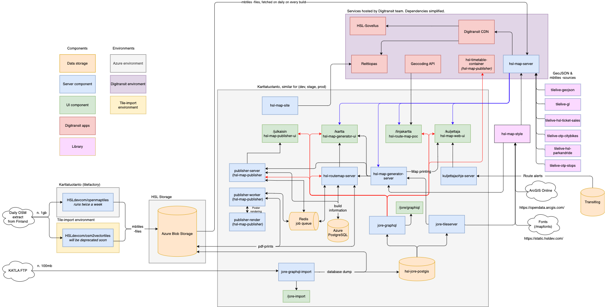

# Instructions

Image is made using draw.io, the source xml file can be imported and modified using their online tool.

## Karttatuotanto Azure environment, data flow and depending services

Arrows point the general direction of data flow.


### Data sources

- **Katla FTP** "infopoiminta" Daily subset of JORE data containing routes, stops and timetables. `hsl-jore-import` checks FTP server for a zip file and updates `hsl-jore-postgis` each night at 00:30.
- **Daily OSM data extract** OSM data covering whole Finland in OSM PBF-format. Hosted at HSL in https://karttapalvelu.storage.hsldev.com/finland.osm/finland.osm.pbf Essentially a mirror of [Geofabrik](https://download.geofabrik.de/europe/finland.html) daily extract.
- **Fonts** proprietary font stack. Hosted at http://static.hsldev.com/mapfonts/
- **Ticket sales points** ArcGIS portal for [HSL Geodata](https://public-transport-hslhrt.opendata.arcgis.com/datasets/hsln-myyntipisteet).

### JORE import process

The `hsl-jore-import` checks KATLA FTP-server for new "infopoiminta" zip file containing JORE routes, stops and timetables every night at 00:30. If a new file is found, the import process in run. The importer contains schema for the PostgreSQL database (with PostGIS extension), SQL functions for JORE GraphQL API and data import logic. The data import uses `jore-geometry-matcher` to match JORE geometry to more detailed OSM geometry. The update is done to a new schema in the `hsl-jore-postgis` database and after finishing, the schema is altered to the production schema in one transaction. SQL-dump of the database is also uploaded to blob storage as a backup. In case the `hsl-jore-postgis` database container dies, the backup dump is read into the database when the container restarts.

## Karttatuotanto Docker Swarm services and deploy dependencies


Generated with [docker-compose-viz](https://github.com/pmsipilot/docker-compose-viz)

Considering the current working directory is where your `docker-compose.yml` file is located:

```
docker run --rm -it --name dcv -v $(pwd):/input pmsipilot/docker-compose-viz render -m image docker-compose.yml
```

This will generate the `docker-compose.png` file in the current working directory.
